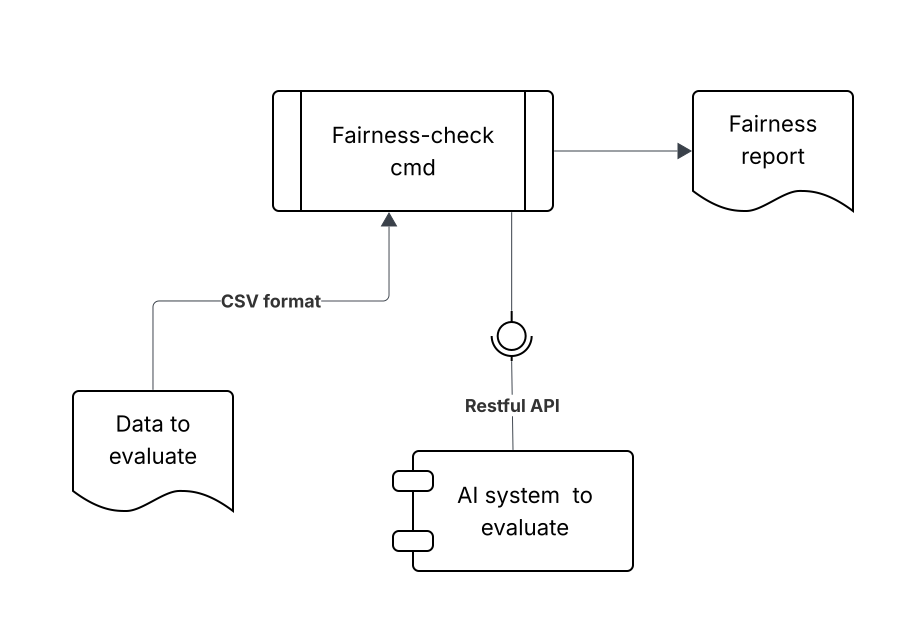

# Fairness Check

[](https://www.python.org/downloads/)
[](https://opensource.org/licenses/MIT)

## Introduction

Fairness Check is a command-line tool designed to evaluate the fairness of AI systems accessible via HTTP API endpoints. It tests whether your system's answers are biased across different demographic groups by calculating key fairness metrics.

### What This Tool Does

1. **Loads configuration** from a YAML file specifying your classifier endpoint and dataset
2. **Reads  data** from a CSV file containing features, outcome labels, and sensitive attributes (e.g., gender, race)
3. **Calls the restful API** endpoint for each test sample to get predictions/classifications/answers.
4. **Calculates fairness metrics**:
   - **Demographic Parity Difference**: Measures if all groups receive positive predictions at the same rate (0 = perfect fairness)
   - **Equal Opportunity Difference**: Measures if all groups with true positive labels are correctly predicted at the same rate (0 = perfect fairness)
5. **Reports results** showing whether your classifier meets fairness thresholds





### Key Features

- **Simple CLI**: Built with docopt for easy command-line usage
- **Flexible Endpoint Testing**: Works with any HTTP API that returns binary predictions
- **Configuration-Driven**: YAML-based config files for reproducible testing
- **Type-Safe**: Full type annotations using Pydantic for validation
- **Containerized**: Docker support for running anywhere without local dependencies
- **Automated CI/CD**: GitHub Actions workflows for testing and publishing

## Project Structure

```
fairness-check/
├── .github/
│   └── workflows/
│       ├── docker-publish.yml   # Builds and publishes Docker images
│       ├── code-quality.yml     # Code formatting checks
│       └── test.yml             # Automated testing
├── src/fairness_check/
│   ├── __init__.py              # Package version
│   ├── fairness_check_cmd.py   # CLI entry point (uses docopt)
│   ├── config.py                # YAML config loader with Pydantic validation
│   ├── classifier_client.py    # HTTP client for calling classifier endpoints
│   ├── runner.py                # Test orchestration and execution
│   └── metrics.py               # Fairness metric calculations
├── mock_server/
│   ├── app.py                   # FastAPI mock classifier for testing
│   ├── requirements.txt         # Mock server dependencies
│   └── Dockerfile               # Mock server containerization
├── tests/                       # Test suite
├── data/
│   └── test_dataset.example.csv # Example test dataset
├── config.yaml                  # User configuration file
├── Dockerfile                   # Main CLI tool containerization
├── .dockerignore                # Docker build exclusions
├── pyproject.toml               # Project dependencies and metadata
└── README.md                    # This file
```

### File Descriptions

- **`fairness_check_cmd.py`**: Command-line interface using docopt for parsing commands (`test`, `validate`, `--help`)
- **`config.py`**: Loads and validates YAML configuration files using Pydantic models
- **`classifier_client.py`**: HTTP client that makes requests to your classifier endpoint and extracts predictions
- **`runner.py`**: Orchestrates the testing workflow (load dataset → get predictions → calculate metrics)
- **`metrics.py`**: Implements fairness calculations (demographic parity, equal opportunity, accuracy)
- **`mock_server/app.py`**: FastAPI server that provides mock classification endpoints for testing

## Installation

### Option 1: Using Docker 

No local Python installation required. Pull the pre-built image from GitHub Container Registry:

## Using Docker

Pulling and existing image from a repository if exists:

```bash
# Pull the latest version
docker pull ghcr.io/gcabero/fairness-check:latest
```
or build it locally:

```bash
git clone https://github.com/gcabero/fairness-check.git
cd fairness-check
docker build -t fairness-check:latest .
```

verify the installation:

```bash
docker run --rm fairness-check:latest --version
```
or 

```bash
python verify_setup.py
```


```bash
### Option 2: Local Installation from Source

Requires Python 3.10+ and [uv](https://github.com/astral-sh/uv) package manager.

```bash
git clone https://github.com/gcabero/fairness-check.git
cd fairness-check

# Install with uv (recommended)
uv sync --all-extras

# Activate the virtual environment to be able to invoke the executable
source .venv/bin/activate 

# Or with pip
pip install -e .

# Verify installation
fairness-check --version
```

## How to Run It

### Configuration

Create a `config.yaml` file to specify your classifier endpoint and test dataset (you can copy the example on and replace):

```yaml
# System's to evaluate endpoint
endpoint:
  url: "http://localhost:8000/classify"     # Required: Your classifier/AI URL
  method: "POST"                             # GET or POST (default: POST)
  headers:                                   # Optional HTTP headers
    Content-Type: "application/json"
    User-Agent: "FairnessCheck/0.1.0"
  timeout: 30                                # Request timeout in seconds
  # auth_token: "your-api-token"            # Optional: Bearer token authentication

# Test dataset configuration
dataset:
  path: "data/test_dataset.example.csv"     # Path to CSV file
  features_column: "features"                # Column with features to send to endpoint
  labels_column: "label"                     # Column with true labels (0 or 1) or outputs from the system to evaluate
  sensitive_column: "sensitive_attribute"    # Column with group identifiers

# Fairness thresholds (optional)
fairness:
  demographic_parity_threshold: 0.1          # Max acceptable difference (default: 0.1)
  equal_opportunity_threshold: 0.1           # Max TPR difference (default: 0.1)
```

#### Endpoint Requirements

Your classifier endpoint must:

**Accept** a JSON request:
```json
{
  "features": "value_from_csv"
}
```

**Return** a JSON response with either format:
```json
{
  "inference": 1   
}
```


### Generating Fairness Reports

#### With Docker

```bash
# Validate your configuration
docker run --rm \
  -v "$(pwd)/config.yaml:/app/config.yaml:ro" \
  ghcr.io/gcabero/fairness-check:latest validate config.yaml

# Generate fairness report
docker run --rm \
  -v "$(pwd)/config.yaml:/app/config.yaml:ro" \
  -v "$(pwd)/data:/app/data:ro" \
  ghcr.io/gcabero/fairness-check:latest report config.yaml --verbose
```

**Note:** If your classifier is running on `localhost`, use `host.docker.internal` in your config:
```yaml
endpoint:
  url: "http://host.docker.internal:8000/classify"
```

#### Locally Installed

```bash
# Validate configuration
fairness-check validate config.yaml

# Generate fairness report
fairness-check report config.yaml

# Generate with verbose output
fairness-check report config.yaml --verbose
```

### Example Output

```
============================================================
FAIRNESS TEST RESULTS
============================================================

Total predictions: 100
Accuracy: 85.00%

Fairness Metrics:
  demographic_parity_difference: 0.0450
  equal_opportunity_difference: 0.0320

✓ Fairness thresholds met
```

### Interpreting Results

- **Demographic Parity Difference = 0.0450**: Selection rates differ by 4.5% between groups (within 10% threshold ✓)
- **Equal Opportunity Difference = 0.0320**: True positive rates differ by 3.2% between groups (within 10% threshold ✓)

Values exceeding 0.1 (10%) typically indicate fairness concerns that should be investigated.

## How to Run Tests

### Test Data Structure

Test data must be in CSV format with three required columns:

```csv
features,label,sensitive_attribute
"user_feature_1",1,"group_A"
"user_feature_2",0,"group_A"
"user_feature_3",1,"group_B"
"user_feature_4",0,"group_B"
```

**Column Descriptions:**
- `features`: Data to send to your classifier (can be any format your endpoint accepts)
- `label`: Ground truth label (0 or 1)
- `sensitive_attribute`: Demographic group identifier (e.g., "male"/"female", "group_A"/"group_B")

Column names are configurable in `config.yaml` under the `dataset` section.

### Mock Server for Testing

A FastAPI-based mock classifier server is included for quick testing without a real classifier.

#### Mock Server Endpoints

- **`/classify`**: Returns random binary predictions (0 or 1)
- **`/classify/random`**: Same as `/classify`
- **`/classify/biased`**: Always returns prediction=1 (useful for testing fairness detection)
- **`/health`**: Health check endpoint

#### Running the Mock Server

**Option 1: Docker (Recommended)**

```bash
# Build the mock server image
cd mock_server
docker build -t mock-server:latest .

# Run the server
docker run -d -p 8000:8000 --name mock-server mock-server:latest

# Test it's working
curl -X POST http://localhost:8000/classify \
  -H "Content-Type: application/json" \
  -d '{"features": "test_value"}'

# Expected response: {"prediction": 0, "features": "test_value"}  // 0 or 1 randomly

# Stop the server
docker stop mock-server
docker rm mock-server
```

**Option 2: Run Locally**

```bash
cd mock_server

# Install dependencies
uv pip install -r requirements.txt

# Run the server
python app.py
```

The server starts on `http://localhost:8000` with auto-reload enabled for development.

#### Using Mock Server with Fairness Check

Update your `config.yaml`:

```yaml
endpoint:
  url: "http://localhost:8000/classify"  # Or host.docker.internal if using Docker
  method: "POST"
  timeout: 30

dataset:
  path: "data/test_dataset.example.csv"
  features_column: "features"
  labels_column: "label"
  sensitive_column: "sensitive_attribute"
```

Then run:

```bash
# With Docker
docker run --rm \
  -v "$(pwd)/config.yaml:/app/config.yaml:ro" \
  -v "$(pwd)/data:/app/data:ro" \
  ghcr.io/gcabero/fairness-check:latest report config.yaml --verbose

# Or locally
fairness-check report config.yaml --verbose
```

### Running Development Tests

For developers working on the codebase:

```bash
# Install dev dependencies
uv sync --all-extras

# Run full test suite
uv run pytest tests/ -v

# Run with coverage
uv run pytest tests/ -v --cov=fairness_check 


# Run specific test file
uv run pytest tests/test_metrics.py -v

# Run code quality checks
uv run black src/ tests/
```

## GitHub Workflows

The project includes automated GitHub  workflows for CI/CD.  
TODO: It still needs to configure the actions to hook them and trigger them on every commit

### Code Quality Checks (`code-quality.yml`)

Ideally run them before pushing

## Formatting

```bash

uv run black src/ tests/
```
## Vulnerability Scanning

```bash
# Locally scan for vulnerabilities
uv run pip-audit check
```

TODO: include static analysis tool

### Automated Tests (`test.yml`)

Runs the test suite on every push and pull request to ensure code quality.

```bash
# Locally run tests before pushing
uv run pytest tests/ -v
```

## Development & Contributing

### Development Setup

```bash
# Fork and clone the repository
git clone https://github.com/gcabero/fairness-check.git
cd fairness-check

# Install with dev dependencies
uv sync --all-extras

# Install the CLI tool in editable mode
uv pip install -e .
```

### Code Style

- Follow [PEP 8](https://pep8.org/) style guide
- Use Black for formatting (line length: 100)
- Write Google-style docstrings for all public functions
- Include type hints for better code clarity

### Pull Request Process

1. **Create a feature branch**
2. **Make your changes**
   - Write clean, documented code
   - Add tests for new functionality
   - Update documentation as needed
3. **Run quality checks**
4. **Commit your changes**
5. **Push to your fork**
6. **Open a Pull Request** against the `main` branch of the original repository

## References

- **Fairness Metrics**: [Fairlearn User Guide](https://fairlearn.org/main/user_guide/assessment/common_fairness_metrics.html)
- **Test Datasets**: [UCI Adult Dataset](https://archive.ics.uci.edu/ml/datasets/adult)
- **Other**: https://arxiv.org/html/2507.18561v1#bib.bib6

## License

This project is licensed under the MIT License - see the [LICENSE](LICENSE) file for details.


